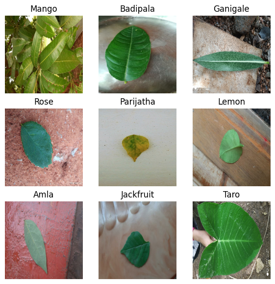
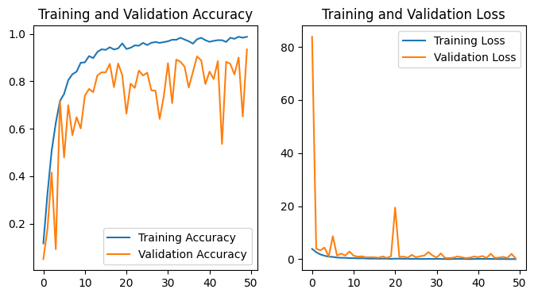
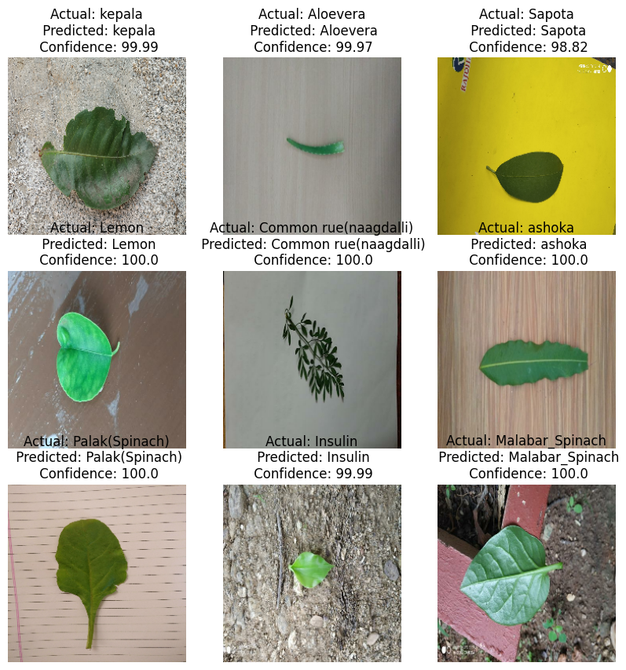

# Medicine Leaf Classification Using Transfer Learning and Fine Tuning

Image classificastion is one of the basic and important task in the Computer vision. With the evolution of Convolution Neural Networks, the task of image classification has become popular and easier since AlexNet won ImageNet large-scale visual recognition competition in 2012. These Convolution neural networks consists of several convolution layers where each layer learns the features of the data that they are being trained on. Once these layers extracted features, they were sent into fully connected layers and then to output layer with softmax activation which gives the probabilities of classes. The output layer should contain number of neurons equal to the number of classes that the data have. 
When deep learning techniques are used, there is high chance that the model is being overfitted on the data as the deep learning tasks require huge data to learn and perform well. Hence the major problems of using deep learning is 
  * Requires huge data 
  * Prone to overfitting 
  * Requires huge computational resources. 

[!https://www.kaggle.com/code/chaitanyakolliboyina/medicinal-leaf-fine-tuning-inceptionresnetv2-94?scriptVersionId=165236135]Medicinal_leaf_Fine_tuning(InceptionResnetV2)-94%


## Transfer Learning
One solution to all three problems is "Transfer Learning". Imagenet consists of millions of images belongs to 1000 classes and it's been acting as a benchmark for the task of image classification. Every new architecture and technique for image classification is been tested on it. These architectures are proven to perform well on image classification tasks. Several deep learning frameworks like tensorflow, pytorch provides these models to use on the image classification tasks. 

Once these models are trained on imagenet dataset, the weights are stored. These weights are re used along with the model on the custom task. These models are regularized to avoid overfitting and trained in state of the art hardware (GPUs). This results in saving training time and gives good results comparitively. 
### Dataset
Coming to the article, the task is to classify Indian medicinal Leaves. The data consists of 80 types of leaf images(80 classes). Data is downloaded from kaggle . Data size is ~9.5 GB. Total number of images are 6900 with different shapes and sizes. All images are sorted into their respective folder with folder name as name of the leaf. 

### Step 1: Importing 
Environment chosen for this is kaggle with P100 GPU as accelerator. First step is to import all the necessary libraries, classes and functions.
``` 
import os
import shutil
from PIL import Image
import numpy as np
import pandas as pd
import matplotlib.pyplot as plt
import tensorflow as tf
from tensorflow.keras import layers
from tensorflow.keras.optimizers import Adam
from tensorflow.keras.utils import image_dataset_from_directory
from tensorflow.keras.models import Model,Sequential,save_model,load_model
from tensorflow.config import list_physical_devices
from tensorflow.config.experimental import set_memory_growth

```
### Step 2: Data Collection
Since the environment is kaggle, we can't manipulate the input as it have only read access. So it's better to store the data into the output directory which makes our task easy.
```
# Paths
root_dir = r"/kaggle/input/indian-medicinal-leaf-image-dataset/Medicinal Leaf dataset"
out_dir = r"/kaggle/working"
```
When we use tensorflow, it allocates the memory in the beginning of the task which most of the time results in giving OOM Error, basically its telling you that you don't have enough memory. P100 GPU gives you only 16GB of memory in kaggle. So we set the memory growth as shown below to allocate memory only when it's required.
```
device = list_physical_devices("GPU")
print(device)

if device:
    try:
        tf.config.experimental.set_memory_growth(device[0], True)
    except RuntimeError as e:
        print(e)
```
what this code do is identifing the devices and setting memory growth so the GPU allocates the memory when there is requirement only instead of assigning all the memory in the beginning. 
Once it is done, the next step involves is creating the directories in the output directory to store the data.
```
for folder in os.listdir(root_dir):    
    folder_paths = os.path.join(out_dir,"data",str(folder))
    os.makedirs(folder_paths,exist_ok = True)
```
This creates folders in the output directory with same names as in the dataset.

### Step 3: Data Validation
It is important that our data is in correct format before feeding into the model. Most of the time this step is avoided in image classification task as it contains only images. But in this dataset it has videos as well. So to identify and remove them from the dataset before saving into the output folders this step is necessary here. Below is the function to validate each image.
```
from PIL import Image

def validate_image(image_path):
    try:
        img = Image.open(image_path)
        img.verify()  # Raises an error for corrupt images
        return True
    except Exception as e:
        print(f"Invalid image for {image_path}: {e}")
        return False
```
Then this function is applied on each image before storing them.
```
data = r"/kaggle/working/data"

for names in os.listdir(data):
    filepaths = os.path.join(root_dir,names)
    for files in os.listdir(filepaths):
            val = validate_image(os.path.join(filepaths,files))
            if val:
                image = Image.open(os.path.join(filepaths,files))
                image.save(os.path.join(data,names,files))
```
This will help you to save only images from the original data into the output directory. This is stored in the folder called 'data'
### Step 4: Data Visualization

Data is fed into deep learning models as batches instead of single image each time for faster training. Hence several parameters are declared before like batch size and image sizes. 
```
batch_size = 32
image_width = 224
image_height = 224
```
Here to load the data first the entire dataset is loaded using image_dataset_from_directory() from tensorflow which we already imported in the beginning. This returns tf.data.Dataset object.
```
dataset = image_dataset_from_directory(
             data,
             labels = 'inferred',
             label_mode = 'int',
             color_mode = 'rgb',
             class_names = None,
             batch_size = batch_size,
             image_size=(image_height,image_width),
             shuffle=True,
             seed=123,
             )
```
This will give you the output : Found 6900 files belonging to 80 classes. 
This indicates that there are 6900 files in total in our dataset which belong to 80 classes and this data is available in batches. 
```
len(dataset)
```                 
This prints 216, which is nothing but number of batches of data of size 32 i.e each batch contains 32 images (216*32 = ~ 6900). The last batch may not contain exactly 32 images in this case but remaining batches has 32 images. 
```
classnames = dataset.class_names
print(classnames, sep = ",") 

# OUtput:  ['Aloevera', 'Amla', 'Amruthaballi', 'Arali', 'Astma_weed', 'Badipala', 'Balloon_Vine', 'Bamboo', 'Beans', 'Betel', 'Bhrami', 'Bringaraja', 'Caricature', 'Castor', 'Catharanthus', 'Chakte', 'Chilly', 'Citron lime (herelikai)', 'Coffee', 'Common rue(naagdalli)', 'Coriender', 'Curry', 'Doddpathre', 'Drumstick', 'Ekka', 'Eucalyptus', 'Ganigale', 'Ganike', 'Gasagase', 'Ginger', 'Globe Amarnath', 'Guava', 'Henna', 'Hibiscus', 'Honge', 'Insulin', 'Jackfruit', 'Jasmine', 'Kambajala', 'Kasambruga', 'Kohlrabi', 'Lantana', 'Lemon', 'Lemongrass', 'Malabar_Nut', 'Malabar_Spinach', 'Mango', 'Marigold', 'Mint', 'Neem', 'Nelavembu', 'Nerale', 'Nooni', 'Onion', 'Padri', 'Palak(Spinach)', 'Papaya', 'Parijatha', 'Pea', 'Pepper', 'Pomoegranate', 'Pumpkin', 'Raddish', 'Rose', 'Sampige', 'Sapota', 'Seethaashoka', 'Seethapala', 'Spinach1', 'Tamarind', 'Taro', 'Tecoma', 'Thumbe', 'Tomato', 'Tulsi', 'Turmeric', 'ashoka', 'camphor', 'kamakasturi', 'kepala']
```
This will print the class names as a list. 
```
for image_batch,label_batch in dataset.take(1):     # .take(1) => takes 1 batch , 1 can be choice
    print(image_batch.shape, label_batch.shape)

#Output : (32, 224, 224, 3) (32,)
```
Below code helps to visualize the images in 3x3 grid with their names
```
plt.figure(figsize = (7,7))
for images,labels in dataset.take(1):
    for i in range(9):
        ax = plt.subplot(3,3,i+1)
        plt.imshow(images[i].numpy().astype('uint8'))
        plt.title(classnames[labels[i]])
        plt.axis("off")
```


### Step 5: Preparing training, validation and test set
It is important that our model not just performs on the training but but to perform well on unseen data. So its advicable that data is seperated into 3 parts training, validation and testing data. Test data is not used untill we are sure that model is performing well. To know whether model is performing well, we use the validation data to test it and then if it's not, we tune the parameters of the model, apply regularization, change the architecture.
Data is divided into training, validation and test set in following proposition 

* training ==> 80 %
* Validation ==> 10%
* Testing ==> 10%
```
# Train data

train_size = 0.8 
train_data = dataset.take(int(len(dataset)*train_size))

test_data = dataset.skip(int(len(dataset)*train_size))

val_size = 0.1

valid_data = test_data.take(int(len(dataset)*val_size))

test_data = test_data.skip(int(len(dataset)*val_size))

print(len(train_data), len(valid_data),len(test_data))

#Output: 172 21 23 
```
Here two functions are being used .take() and .skip(). 
.take() takes the number of batches mentioned and skip leaves the mentioned number of batches and returns the remaining batches.
Once the datasets are created to Speed up loading the data into memory, we use cache() and prefetch() from tf.data.Dataset class. 
```
AUTOTUNE = tf.data.AUTOTUNE

train_data = train_data.cache().prefetch(buffer_size = AUTOTUNE)

valid_data = valid_data.cache().prefetch(buffer_size = AUTOTUNE)

test_data = test_data.cache().prefetch(buffer_size = AUTOTUNE)
```
### Step 6: data augmentation, resize and rescale
The data we have is inconsistent in size, that is every image is not in sam e size and each image consists of 0–255 values in the pixels. This can slower the training. So we rescale these values such that each pixel value lies between 0–1. Deep learning models takes images of same size hence we resize every image into fixed size. 
Compared to imagenet data size(million images), 6900 images are pretty samll number. Hence we use data augmentation to solve that. With data augmentation we create new samples from the images we have by modifiying slightly as mentioned below.
```
resize_and_rescale = tf.keras.Sequential([
  tf.keras.layers.Resizing(image_height,image_width),
  tf.keras.layers.Rescaling(1./255),
])

data_augmentation = tf.keras.Sequential([
#   tf.keras.layers.RandomFlip('horizontal_and_vertical'),
  tf.keras.layers.RandomRotation(0.2),
])
```
### Step 7: Model Building

Pre-trained model(InceptionResnetV2) is being imported as a base model, data augmentation isn't performed well in this case hence removed. Then custom dense layers are added to the pre trained model to use transfer learning. As it involves training the new layers, dropout is being used to avoid overfitting the model. Then output layer is modified to the use case (80 classes).
``` 
def create_model(freeze = None):
    base_model = tf.keras.applications.InceptionResNetV2(include_top = False,
                                                  weights = 'imagenet',
                                                  input_shape=(224, 224, 3))
#     base_model = tf.keras.applications.EfficientNetV2B3(include_top = False,
#                                                   weights = 'imagenet',
#                                                   input_shape=(224, 224, 3))
    if freeze:
        base_model.trainable = False
     
    model = tf.keras.Sequential([
        tf.keras.layers.Input((224,224,3)),
        resize_and_rescale,
#         data_augmentation,
        base_model,
        tf.keras.layers.Flatten(),
        tf.keras.layers.Dense(256, activation='relu'),
        tf.keras.layers.Dropout(0.3),
        tf.keras.layers.Dense(128, activation='relu'),
        tf.keras.layers.Dense(80, activation='softmax')  # Adjust for your number of classes
    ])
return model
```
For this task, both InceptionResnetV2 and EffecientNetV2B3 are tested out of which InceptionResnetV2 performs lot better than the later. 
Here single learning rate is not used. Instead multiple learning rates are used in different boundaries. i.e
* 1–20 ==> 0.0001
* 21–35 ==> 0.0005
* 36–50 ==> 0.001

This approach is used to converge the model so the performance will inturn increased
### Step 8: Defining callbacks 
Callbacks helps to save model after each epoch or if the condition satisies the monitored metric.
from tensorflow.keras.callbacks import ModelCheckpoint, LearningRateScheduler, EarlyStopping
```
# Function to adjust learning rate after each epoch
# def learning_rate_scheduler(epoch):
#     initial_lr = 0.001  # Adjust initial learning rate as needed
#     decay = 0.1  # Adjust decay factor as needed
#     return initial_lr * (decay ** epoch)
# learning_rate_scheduler = LearningRateScheduler(
#     lambda epoch: 0.001 * (0.1 ** epoch)  # Adjust initial_lr and decay as needed
# )
boundaries = [20, 35]
values = [0.0001, 0.0005, 0.001]

lr_schedule = tf.keras.optimizers.schedules.PiecewiseConstantDecay(boundaries, values)

# ModelCheckpoint callback to save model after every epoch
checkpoint = ModelCheckpoint(
    filepath='/kaggle/working/mod_{epoch}.keras',  # Replace with your desired path
    save_best_only=True,  # Set to True to save only the best model based on a metric
    monitor='val_accuracy',  # Monitor validation accuracy during training
    save_weights_only=False,  # Set to True to save only model weights
    verbose=1  # Set to 0 for silent operation
)

# EarlyStopping callback to stop training if validation accuracy doesn't improve
early_stopping = EarlyStopping(
    monitor='val_accuracy',  # Monitor validation accuracy
    min_delta=0.05,  # Minimum required change in the monitored metric
    patience=50,  # Number of epochs with no improvement to wait before stopping
    baseline = 0.5,
    restore_best_weights=True  # Restore the weights of the best model before stopping
)
```
Once the model is created it should be trained with specific learning rate. Since these are pre trained models, at first the layers are freezed so the imagenet weights doesn't modified while training (Transfer learning). 
Here with transfer learning i got only _63% as validation accuracy although training accuracy reached 98%_. Hence i decided to fine tune the model. 
### Fine-tuning
Model is being trained on P100 GPU using CentralStorageStratergy for faster training.
Final model is not just leveraged benifits of transfer-learning, but fine tuned for better performance. There's good chance that model will be overfit during fine-tuning. To tacke that, multiple low learning rates were used across boundaries. Here i have used 3 learing rates across 2 boundaries 

### Step 9: Training and Validation
```
stratergy = tf.distribute.experimental.CentralStorageStrategy()

with stratergy.scope():
    
    model = create_model(freeze = False)
  
    model.summary()
    model.compile(optimizer=tf.keras.optimizers.Adam(learning_rate = lr_schedule), 
                  loss=tf.keras.losses.SparseCategoricalCrossentropy(),
                  metrics=['accuracy'])

# Train the model on the replicated dataset
    history = model.fit(train_data,
                        epochs=50, 
                        validation_data=valid_data,
                        callbacks=[checkpoint, early_stopping])
                    
```
Central storagestratergy is used when you want to leverage GPU and you have a one GPU and good CPU-GPU connection. To use that ,model, compiling the model and fit the model all hs to be done under it's scope, if not, this will throw you an error.
By running the above code, every time validation accuracy is improved, model gets stored in the path mentioned in the checkpoints. 

If you want to save the final model, you can save it by using model.save() method. It takes path as parameter. If you want to store the entire model, you should use .keras as extension to the file path. if you want to save only weights you have to use .h5 extension to the filepath
```
model.save("/kaggle/working/model_final.keras")
```
**I got validation accuracy  of ~93.45% with fine tuning the model with multiple learning rates**, which is lot better than just using transfer learning.
### Step 10: Model Evaluation
```
model.evaluate(test_data)

#Output: 23/23 [==============================] - 87s 364ms/step - loss: 0.4258 - accuracy: 0.9061
[0.4257980287075043, 0.9060773253440857]
```
**On test dataset, model gave ~91% which indicates out model can generalise well and works better on the unseen data as well and it is far better than the custom CNN and pre-trained models (Transfer learning) (validation accuracy for pre trained ~= 62 %)**

### Step 11: Training and validation plots
```
train_accuracy = history.history['accuracy']
val_accuracy  = history.history['val_accuracy']

train_loss = history.history['loss']
val_loss = history.history['val_loss']

epochs = 50

plt.figure(figsize = (8,4))
plt.subplot(1,2,1)
plt.plot(range(epochs),train_accuracy, label = 'Training Accuracy')
plt.plot(range(epochs),val_accuracy, label = 'Validation Accuracy')
plt.legend(loc = 'lower right')
plt.title("Training and Validation Accuracy")

plt.subplot(1,2,2)
plt.plot(range(epochs),train_loss, label = 'Training Loss')
plt.plot(range(epochs),val_loss, label = 'Validation Loss')
plt.legend(loc = 'upper right')
plt.title("Training and Validation Loss")
plt.show()
```

On plotting the training and validation metrics using matplotlib. The graphs are as below 



From the plots we can say even the accuracy at the beginning is very low and validation loss is high, the performance is improved well by the end and also the model isn't overfit as we saw the performance on **test data is also more than 90%**. 

### Step 12: Inference/Prediction
Inference in simple terms is the process of giving an image into the model to predict and showing it out to the user. 
```
def predict(model,img):
    img_array = tf.keras.preprocessing.image.img_to_array(images[i].numpy())
    img_array = tf.expand_dims(img_array,0)       # Creating a batch with the image
    
    predictions = model.predict(img_array,verbose = 0)
    predicted_class = classnames[np.argmax(predictions[0])]
    confidence = round(100 * (np.max(predictions[0])),2)
    return predicted_class, confidence
```

Model is trained on the batch data, hence giving one image to it won't work well, even throws an error. Hence the image is converted into a batch using tf.expand_dims() as above. 
model.predict() method gives probabilities of all classes. Hence using argmax on it gives the index that has highest probability. 

By using above function we can predict the class and corresponding confidence of the image.
### Step 13: Visualising the predictions
```
plt.figure(figsize = (10,10))
for images,labels in test_data.take(1):
    for i in range(9):
        ax = plt.subplot(3,3,i+1)
        plt.axis("off")
        plt.imshow(images[i].numpy().astype("uint8"))
        predicted, confidence = predict(model, images.numpy())
        plt.title(f"Actual: {classnames[labels[i]]}\n Predicted: {predicted}\n Confidence: {confidence}")
#     predicted_class = classnames[np.argmax(predicted[0])]
#     print(predicted_class, classnames[labels[i]])
```


Above figure shows the actual class, predicted class by the model and the confidence on 1 batch (1st batch) of the test dataset.

The main goal of this project is to learn how to finetune to the custom use case, how to leverage the GPU for faster training and how to avoid overfitting while fine tuning by using multiple low learing rates across multiple boundaries.
 
I added the original kaggle notebook link above, feel free to refer it and upvote if you find it insightful. Like, comment and Share the article and notebook .

Subscribe to [MLMarvels](https://mlmarvels.beehiiv.com/) for more such articles.